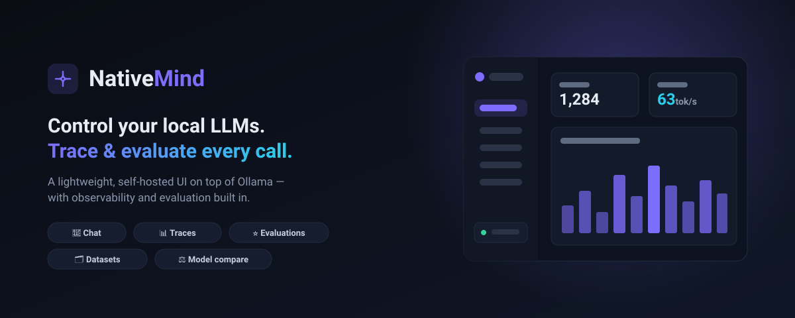

# NativeMind



**A lightweight UI to control your local LLMs — with tracing and evaluation built in.**


NativeMind is a single, self-hosted app that sits on top of [Ollama](https://ollama.com).
Chat with your local models, manage them, compare them side-by-side — and get
**observability and evaluation** on every call, without standing up a heavy
enterprise stack. Clone it, run it, done.

---

## Features

- 💬 **Chat** — streaming conversations with any installed model, with system
  prompt and temperature controls.
- 📦 **Models** — list, pull (with live progress), and delete Ollama models from the UI.
- 📊 **Traces** — every LLM call is automatically logged: prompt, response,
  tokens, latency, and tokens/sec. Browse and filter them.
- ⭐ **Evaluations** — score any response three ways:
  - **Manual** star rating + notes
  - **Auto metrics** (length, latency, speed — deterministic)
  - **LLM-as-judge** — have a local model grade the response 1–10 with a rationale
- 🧪 **Playground** — send one prompt to two models and compare output + metrics.
- 📈 **Dashboard** — aggregate stats: calls, tokens, latency, speed, and eval scores over time.

No external database, no cloud, no telemetry. Data lives in local JSON files under `./data`.

---

## Requirements

- **[Ollama](https://ollama.com/download)** installed and running (default `http://localhost:11434`)
- **Node.js 18.18+** (Node 20+ recommended)

## Quick start

```bash
git clone <your-repo-url> nativemind
cd nativemind
npm install
npm run dev
```

Open **http://localhost:3000**.

If you don't have a model yet, go to the **Models** page and pull one (e.g. `llama3.2`),
or from a terminal:

```bash
ollama pull llama3.2
```

## Production build

```bash
npm run build
npm start
```

## Configuration

Copy `.env.example` to `.env` and adjust:

| Variable            | Default                  | Description                                  |
| ------------------- | ------------------------ | -------------------------------------------- |
| `OLLAMA_HOST`       | `http://localhost:11434` | Where your Ollama server is listening.       |
| `NATIVEMIND_DATA_DIR`  | `./data`                 | Where traces/evals are stored (JSON files).  |

## Docker

### Option A — one command, bundled Ollama (recommended)

Brings up **both** Ollama and NativeMind together — nothing else to install:

```bash
docker compose up
```

Open http://localhost:3000, then pull a model into the bundled Ollama:

```bash
docker compose exec ollama ollama pull llama3.2
```

### Option B — NativeMind only, against Ollama on your host

```bash
docker build -t nativemind .
docker run -p 3000:3000 \
  -e OLLAMA_HOST=http://host.docker.internal:11434 \
  -v "$(pwd)/data:/app/data" \
  nativemind
```

> `host.docker.internal` lets the container reach Ollama running on your host machine.

## How it works

NativeMind is a **Next.js** app. Its API routes proxy the Ollama HTTP API and
transparently record a **trace** for every completion. The store is a small
JSON-file repository (`src/lib/store.ts`) — swap it for SQLite/Postgres by
reimplementing that one module.

```
src/
  app/
    api/            # models, chat, traces, evaluations, stats, conversations
    ...             # dashboard, chat, models, traces, playground pages
  components/        # UI kit, app shell, icons
  lib/               # ollama client, store, types
```

## License

MIT — see [LICENSE](LICENSE). Built to control local LLMs, your way.
